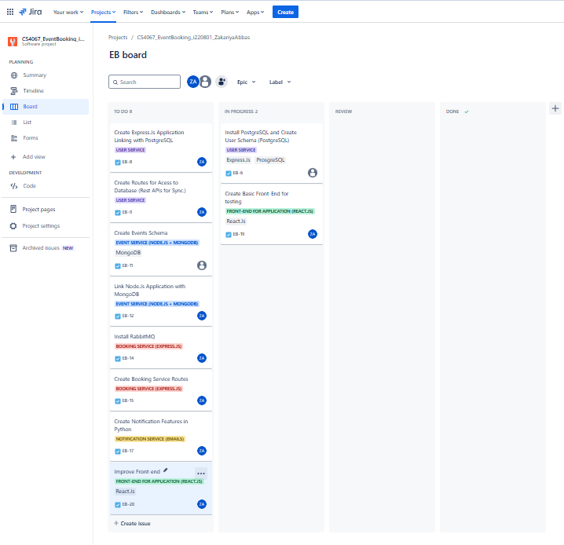
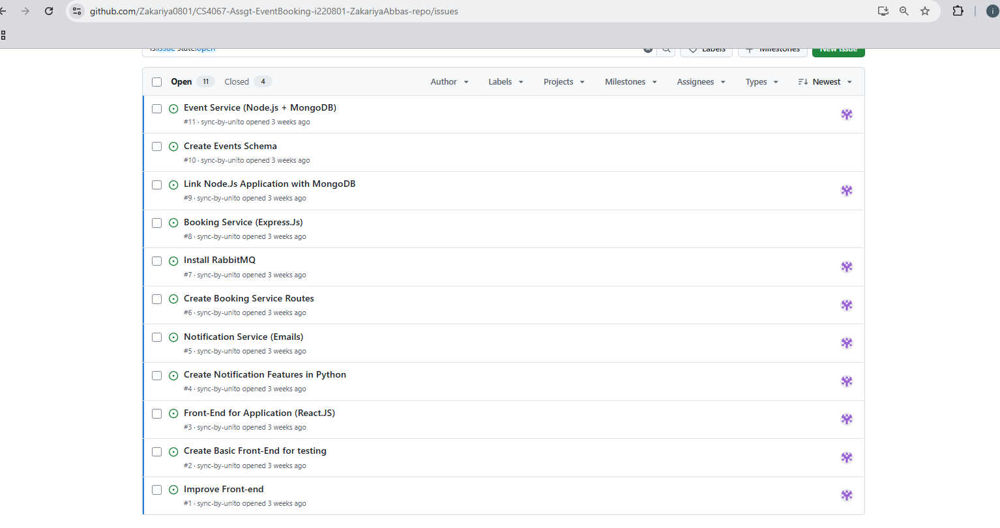

# Online Event Booking Platform Report

## Objective
This report documents the development of an Online Event Booking Platform using a microservices architecture. The project demonstrates:
- Synchronous and asynchronous communication between microservices
- Integration of MongoDB and PostgreSQL for data storage
- Jira integration for issue tracking
- GitHub for version control, project management, and documentation

## Application Overview
### Real-World Use Case
Users can browse events, book tickets, and receive confirmation notifications. The system manages event listings, user accounts, booking payments, and real-time notifications.

## Microservices Architecture

| Microservice        | Functionality                                      | Tech Stack        | Database  | Communication       | Port  |
|---------------------|--------------------------------------------------|------------------|-----------|---------------------|-------|
| **User Service**   | Manages user authentication & profiles           | Express.js       | PostgreSQL | REST API (Sync)     | 3000  |
| **Event Service**  | Manages event listings & details                 | Express.js       | MongoDB    | REST API (Sync)     | 5000  |
| **Booking Service**| Handles ticket bookings, payments & status updates | Express.js       | MongoDB    | REST API (Sync), RabbitMQ (Async) | 4000  |
| **Notification Service** | Sends email/SMS confirmations       | Flask            | MongoDB    | RabbitMQ (Async)   | 6000  |

## Communication Between Microservices

### **Architectural Diagram**

```markdown
                       +---------------------+       +----------------------+
                       |    User Service     | ----> |    Event Service     |
                       |   (Port: 3000)      |  REST |   (Port: 5000)       |
                       +---------------------+       +----------------------+
                                  |                           |
                                  |                           |
                   REST          \|/                         \|/   REST
           +--------------------+ | +---------------------+  |  +--------------------+
           |  Booking Service  | | |  Notification Service |  |  Payment Gateway     |
           |   (Port: 4000)    | | |   (Port: 6000)        |  |  (Mock Service)      |
           +--------------------+ | +---------------------+  |  +--------------------+
                   |              |         |                |
             RabbitMQ Event       |    RabbitMQ Event        |
                   |              |         |                |
                   \------------->|         \--------------->|
```

### **User Service → Event Service (Sync via REST API)**
- Users retrieve available events from the Event Service.
- Example API Call: `GET /events`

### **User Service → Booking Service (Sync via REST API)**
- Users create a booking by calling the Booking Service.
- Example API Call: `POST /bookings` with `{ user_id, event_id, tickets }`

### **Booking Service → Notification Service (Async via RabbitMQ)**
- When a booking is confirmed, the Booking Service publishes an event to RabbitMQ.
- The Notification Service consumes this event and sends a confirmation email.
- Example RabbitMQ Event:
  ```json
  { "booking_id": "12345", "user_email": "user@example.com", "status": "CONFIRMED" }
  ```

### **Booking Service → Payment Gateway (Mock Service) (Sync via REST API)**
- The Booking Service processes payments before confirming a booking.
- Example API Call: `POST /payments` with `{ user_id, amount }`

### **Event Service → Booking Service (Sync via REST API)**
- Before confirming a booking, the Booking Service checks event availability.
- Example API Call: `GET /events/{event_id}/availability`

## API Routes

### **User Service (Port: 3000)**
- `POST /signup` - Register a new user
- `POST /login` - Authenticate user and return token
- `GET /user` - Fetch authenticated user
- `GET /register` - Render registration page
- `POST /register` - Register a new user (alternative endpoint)
- `GET /Dashboard` - Render dashboard page

### **Event Service (Port: 5000)**
- `POST /` - Create a new event
- `GET /` - Retrieve all events
- `GET /:id` - Get event details by ID
- `PUT /:id` - Update an event by ID
- `DELETE /:id` - Delete an event by ID

### **Booking Service (Port: 4000)**
- `POST /` - Create a new booking
- `GET /` - Retrieve all bookings
- `GET /:id` - Retrieve booking details by ID
- `PUT /:id` - Update a booking by ID
- `DELETE /:id` - Delete a booking by ID

### **Notification Service (Port: 6000)**
- `POST /notifications/send` - Send confirmation notification

## Jira and GitHub Integration
To track project progress and manage tasks, we integrated both Jira and GitHub.

### **Jira Board**


### **GitHub Issues**


## Implementation Considerations
### **Best Practices Followed:**
- **Error Handling:** Try-catch blocks implemented to ensure resilience.
- **Logging:** Comprehensive logging across all microservices stored in a single file.
- **Error Messages:** Consistent error handling for clarity and debugging.
- **Coding Standards:** Followed best practices for readability and maintainability.
- **Security:** Used environment variables for sensitive data like API keys and database credentials.
- **API Documentation:** Documented all endpoints specifying request/response formats and error codes.
- **Version Control:** Followed Git best practices, including meaningful commit messages and branching strategies.

## Conclusion
The Online Event Booking Platform successfully integrates multiple microservices, utilizing synchronous REST API calls and asynchronous messaging via RabbitMQ. The architecture ensures scalability, flexibility, and efficiency while incorporating industry best practices in development, logging, security, and documentation. Future enhancements will include containerization and CI/CD pipeline integration.
